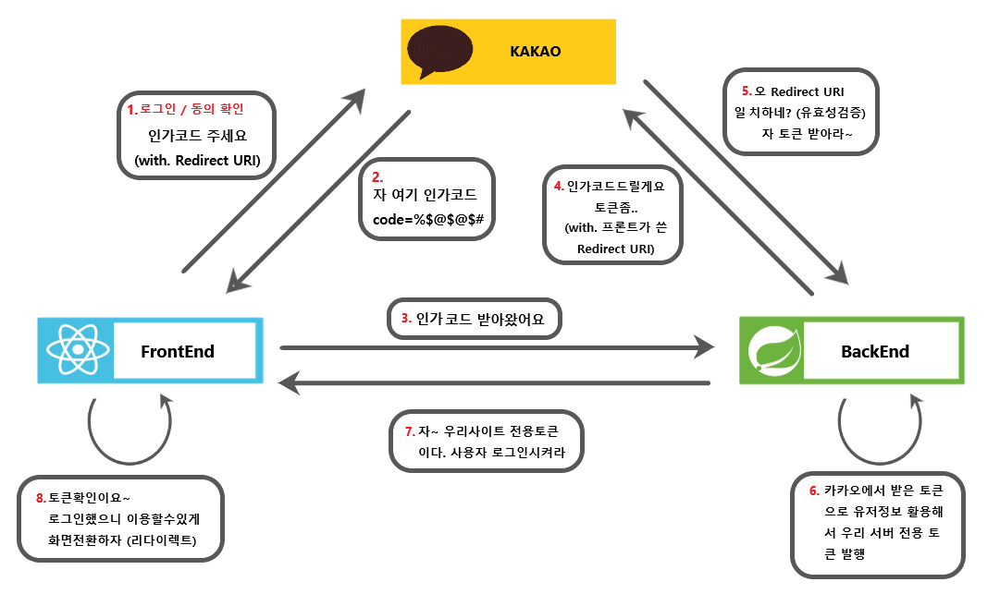

# review-web-practice
* 서버, 클라이언트간 통신 
* client - FE - REACT, axios
* server - BE - MongoDB, EXPRESS
* review CRUD, login, logout, kakao login, signup, pagination


### Kakao Login


### 네이버 클라우드 ubuntu 서버 구축 프로세스

1. 네이버 클라우드 플랫폼 페이지 접속
2. 로그인
3. 콘솔버튼
4. Platform -> classic 설정
5. services -> all -> compute -> server
6. 서버 생성 
    1. 서버 이미지 선택
       - 디스크 크기 : 50GB
       - 이미지 타입 : OS
       - OS 이미지 타입 : ubuntu
       - 서버 타입 : Micro
       - 16.04-64-server 파트의 (다음)클릭
<br><br>

    2. 서버 설정
        - HDD 스토리지 선택
        - 서버 이름 : prac
        - 서버 타입 Micro(무료)
        - -> 다음 버튼 클릭

    3. 인증키 설정
        - 처음 시 : 인증키 생성 // 보유 시 : 보유 인증키 이용
<br><br>

    4. 네트워크 접근 설정
        - 신규 ACG 생성 
            1. 이름 임의 할당
            2. ACG 설정 (두번)
               1. 첫번째 ACG 생성 
                - 접근 소스 : 0.0.0.0/0 (공인ip 대체로, 전체허용 ip 사용)
                - 허용 포트 : 3389 
                2. 두번째 ACG 생성
                  - 접근 소스 : 0.0.0.0/0 (공인ip대체로, 전체허용 ip 사용)
                - 허용 포트 : 22
    5. 해당 서버의 status에서 `포트포워딩 설정` 클릭 및 공인ip 확인
    6. 외부포트: 3389, 내부포트 22 정상 할당 확인

    - 서버에 로그인 하기 위해선 포트포워딩 설정
    - 외부에 서비스하고싶으면 공인 IP 할당받기
<br><br>


7. Filezilla client 다운로드, Putty 다운로드 
8. putty 실행
    1. putty의 Host Name에 네이버 클라우드에서 만든 서버의 공인 ip(포트포워딩) 복붙해서 넣어주기, 포트 3389 넣어주기
    2. saved setting에 이름 넣고, save 클릭해 저장하기
    3. 해당 서버 클릭 후 open 클릭, `root`입력
    4. 네이버 클라우드 서버 우클릭 후 관리자 비밀번호 확인 클릭
    5. 기존에 받은 .pem 인증파일 넣어서 인증 후, 비밀번호 확인
    6. putty 커맨드라인에, 네클에서 받은 비밀번호 입력
    7. 사용자 비밀번호 설정 -> 다음부턴 이 비밀번호로 접근
<br><br>

9. Filezilla 실행
    1. 파일 -> 사이트 관리자 -> 새 사이트
    2. 네클 호스트 ip 복붙 입력, 포트(3389) 입력
    3. 사용자: `root`, 비밀번호: putty에서 설정한 사용자 비밀번호 입력
    4. 연결 -> 리모트 사이트 `/root`로 생성됨 -> 실제 배포시엔 root사용x 다른 사용자 만들어서 배포해야 함

10. putty로 돌아와서
    1. root 사용자 접속
    2. cd /
    3. apt update 커맨드 입력
    4. apt upgrade 입력 -> Y -> Y -> Y
    5. apt install nginx
11. Filezilla로 
    1. filezilla에서 `root/etc/`에 nginx가 설치돼있는 것을 확인
    2. nginx폴더 내의 avaiable 폴더 내에 default 파일을 더블클릭하여 내 로컬에 저장
        - 아마 `c:\users\he1256(내사용자)` 루트에 저장돼있을 것, vs코드로 실행
12. 배포하고자 하는 리액트 서비스의 client 디렉에서 `npm build`로 빌드시킴
13. Filezilla   
    1. 리모트 사이트 경로 : `/var/www/html` 경로접속
    2. 해당 경로 내 기존 파일 삭제
    3. 리액트 프로젝트 경로에서 빌드된 개별파일들 전부 해당 filezilla 디렉 내로 복붙
14. putty
    1. service start nginx 커맨드 실행
15. 네이버 클라우드
    1. 콘솔 => Services => server => public IP 클릭
    2. 공인 IP 신청 (4000원 내야됨)
        - 적용 서버 선택 => 내가 등록했던 서버 
        ```
        공인 IP: 공개된 IP
        비공인 IP: 뒤에서만 보이는 우리만 알아야 할 IP
        ```
    3. ACG 설정 클릭 
        - 특정 ACG 클릭
        - 규칙보기 클릭
        - ACG 설정 버튼 클릭 ->
        ```
        개별 접근권한 설정하는 것임: 보안을 위한 작업
        원래는 PUTTY에서 하나하나 손으로 작업해줘야 하는데,
        이를 네클에서 쉽게 도와주는 기능임
        ```
        ```
        Extend) SSL 인증에서 에러가 났을 시,
        '포트포워딩' 키워드 기억해둘 것 
        ```

<br><br><br>
